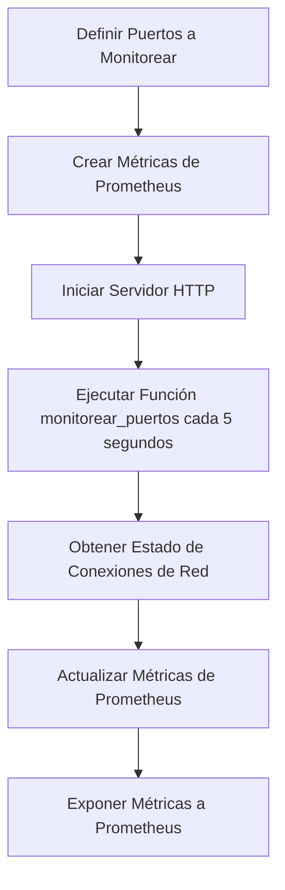

# Proyecto de Monitoreo de Conexiones de Red

Este proyecto está diseñado para monitorear el estado de las conexiones de red en puertos específicos y exponer estas métricas a Prometheus para su recolección y análisis. A continuación, se presenta una descripción general de su funcionamiento:

## Archivos Principales

### Monitoring_ports.py

- Utiliza la biblioteca `psutil` para obtener información sobre las conexiones de red.
- Define los puertos a monitorear a través de una variable de entorno `PUERTOS_A_MONITOREAR`.
- Crea métricas de Prometheus para cada puerto, incluyendo el estado de las conexiones (`TIME_WAIT`, `ESTABLISHED`, `CLOSE_WAIT`, `TOTAL`).
- Inicia un servidor HTTP en el puerto definido por la variable de entorno `PROMETHEUS_PORT` para que Prometheus pueda recolectar las métricas.
- Contiene la función `monitorear_puertos` que actualiza las métricas cada 5 segundos.

### netstatPorts.py

- Utiliza el comando `netstat` para obtener información sobre las conexiones de red.
- Define los puertos a monitorear directamente en el código.
- Crea métricas de Prometheus similares a las de `Monitoring_ports.py`.
- Inicia un servidor HTTP en el puerto 8000 para que Prometheus pueda recolectar las métricas.
- Contiene la función `obtener_conexiones_netstat` que ejecuta el comando `netstat` y captura su salida.
- Contiene la función `monitorear_puertos` que analiza la salida de `netstat` y actualiza las métricas cada 5 segundos.

## Flujo de Trabajo

### Inicialización

1. Se definen los puertos a monitorear.
2. Se crean las métricas de Prometheus para cada puerto.
3. Se inicia un servidor HTTP para que Prometheus pueda recolectar las métricas.

### Monitoreo

1. Cada 5 segundos, se ejecuta la función `monitorear_puertos`.
2. Esta función obtiene el estado de las conexiones de red para los puertos monitoreados.
3. Las métricas de Prometheus se actualizan con la información obtenida.

### Exposición de Métricas

- El servidor HTTP expone las métricas en un formato que Prometheus puede recolectar y analizar.

## Ejecución del Proyecto

Para ejecutar el proyecto, simplemente corre uno de los scripts (`Monitoring_ports.py` o `netstatPorts.py`). Asegúrate de tener las dependencias necesarias instaladas (`psutil`, `prometheus_client`) y de configurar las variables de entorno adecuadas si es necesario.

